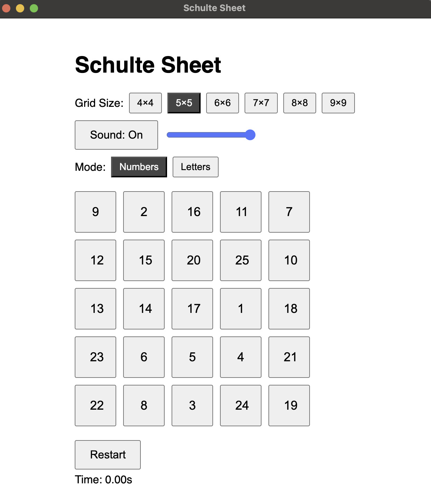

# Schulte Sheet Desktop App

An open-source Electron-based desktop application for training attention and visual perception using Schulte tables.

---

### 🛠️ Installation & Running

```bash
git clone https://github.com/unoms/schulte.git
cd schulte
npm install
npm run start
```

---


